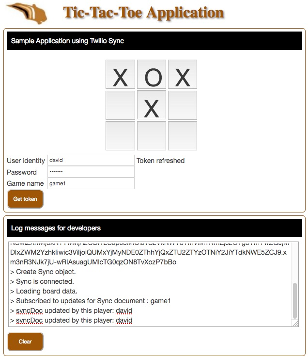

# Twilio Sync Sample Website Application

This repository application is based on the Twilio Sync quickstart:
https://www.twilio.com/docs/sync/quickstart/js

This version is updated with user inputs for the token identity and the Sync document name.
I also enhanced the code documentation.



Following are the steps to configure and use the web application.

## Twilio Console Configuration

1. Create a Sync Service:

[https://www.twilio.com/console/sync/services](https://www.twilio.com/console/sync/services)

2. Create an API key and secret string:

[https://www.twilio.com/console/chat/runtime/api-keys](https://www.twilio.com/console/chat/runtime/api-keys)


## Application Environment Setup

Use your Twilio account values to set the Environment variables used in webserver.js program.
````
$ export ACCOUNT_SID ACxxx...xxx
$ export TOKEN_PASSWORD=mypassword
$ export SYNC_SERVICE_SID ISxxx...xxx
$ export API_KEY SKxxx...xxx
$ export API_KEY_SECRET xxx...xxx
````
Install the required packages.
````
$ npm install --save twilio
$ npm install --save twilio-sync
$ npm install --save express
````
Run the webserver program.
````
$ node webserver.js
````

## Test

Use a browser to call the application:

http://localhost:8000/

Enter a user identity, password, and game name.
Example: david, mypassword, and game1.
Click Get token, to retrieve the token and start the game.

Click one of the square to change it to an "X".
Click the same square to change it to "O".
Click the same square to reset it to blank.
Click the same square to change it to "X".

In another browser tab, call the application:

http://localhost:8000/

Enter a different user identity, password, and same game name.
Example: stacy, mypassword, and game1.

You will see the board as set in the other tab.
Click another square to change it to an X.
Change to the other tab to see the change.

--------------------------------------------------------------------------------
## Program Descriptions

webserver.js : basic HTTP webserver to server the static files (directory docroot) and generate Sync tokens.

docroot : static website with Ajax call to get a Sync token from the webserver.

docroot/index.html : the game page.

docroot/sync.js : the game JavaScript program.

listDocuments.js : list Sync documents.

retrieveDocument.js : retrieve a Sync document, the one used in the sample application.

--------------------------------------------------------------------------------

Cheers...
